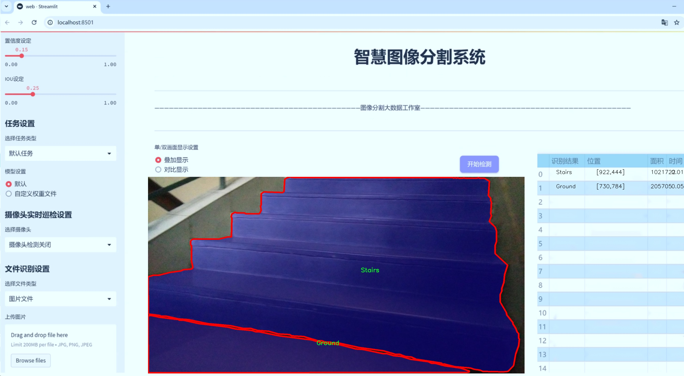
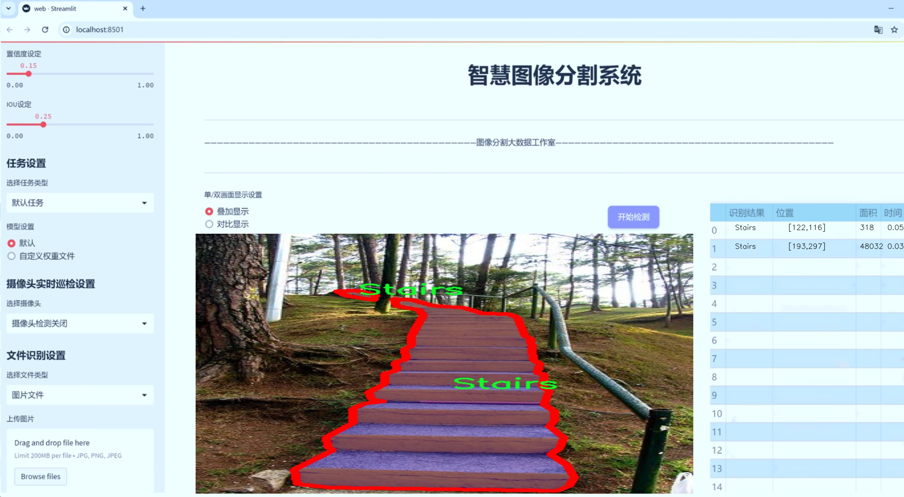
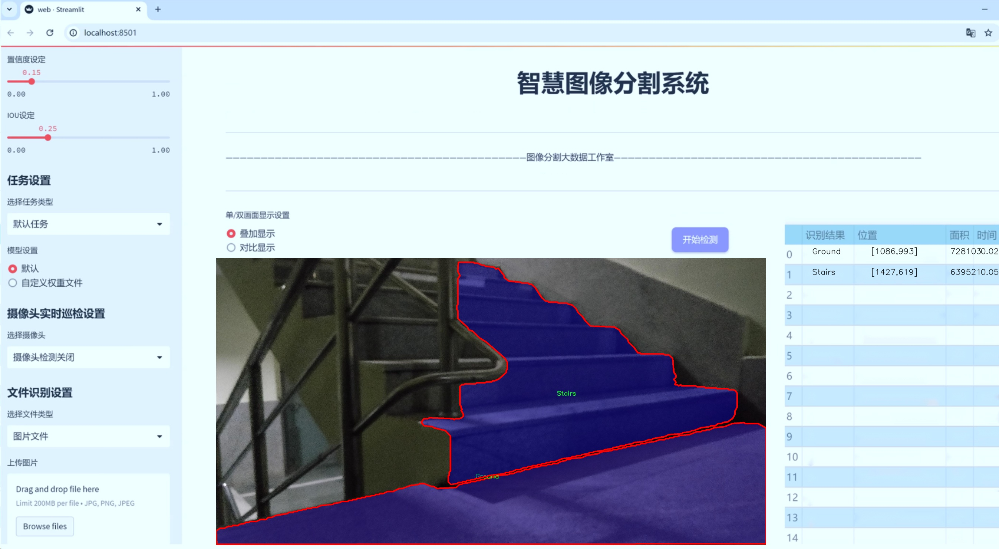
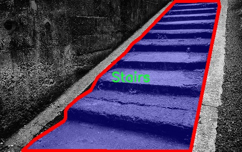
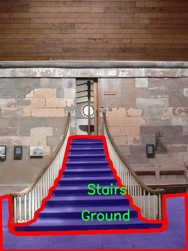
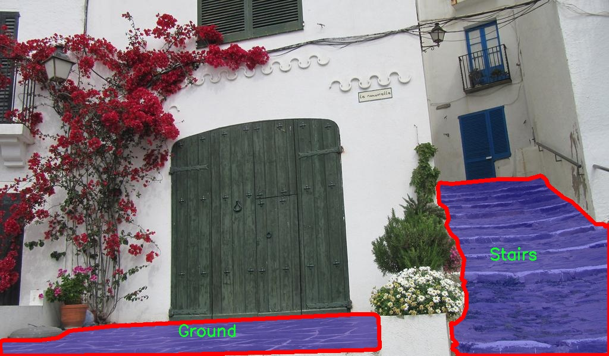
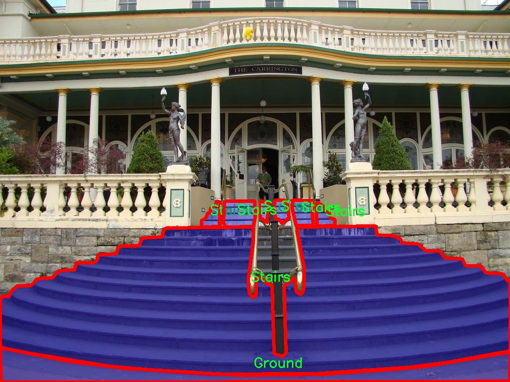
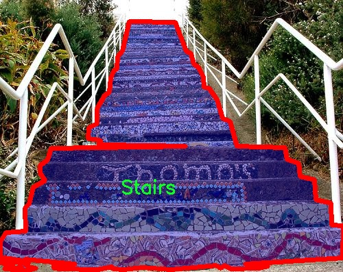

# 楼梯区域分割系统源码＆数据集分享
 [yolov8-seg-FocalModulation＆yolov8-seg-GFPN等50+全套改进创新点发刊_一键训练教程_Web前端展示]

### 1.研究背景与意义

项目参考[ILSVRC ImageNet Large Scale Visual Recognition Challenge](https://gitee.com/YOLOv8_YOLOv11_Segmentation_Studio/projects)

项目来源[AAAI Global Al lnnovation Contest](https://kdocs.cn/l/cszuIiCKVNis)

研究背景与意义

随着城市化进程的加快，楼梯作为重要的建筑元素，广泛应用于公共场所、住宅及商业建筑中。楼梯不仅是人们日常出行的重要通道，也是建筑设计中不可或缺的组成部分。然而，楼梯区域的识别与分割在计算机视觉领域仍然面临诸多挑战，尤其是在复杂环境下的准确性和实时性问题。因此，开发一种高效的楼梯区域分割系统具有重要的理论价值和实际意义。

近年来，深度学习技术的迅猛发展为图像分割任务提供了新的解决方案。其中，YOLO（You Only Look Once）系列模型因其出色的实时检测能力和较高的准确性，成为了目标检测领域的热门选择。YOLOv8作为该系列的最新版本，进一步提升了模型的性能，尤其在小目标检测和复杂背景下的表现。基于YOLOv8的楼梯区域分割系统，能够有效地处理楼梯的多样性和复杂性，为建筑智能化和安全监测提供技术支持。

本研究将基于一个包含1500张图像的楼梯数据集进行模型训练与验证。该数据集涵盖了五个类别：草地、地面、坡道、道路和楼梯，具有较强的代表性和多样性。通过对这些类别的实例分割，能够更好地理解楼梯在不同环境中的表现及其与周围环境的关系。这不仅有助于提升楼梯区域的自动识别能力，还能为后续的智能导航、建筑安全监测及无障碍设计提供数据支持。

在实际应用中，楼梯区域的准确分割对于提升建筑物的安全性和可达性至关重要。尤其是在公共场所，楼梯往往是人流密集的区域，任何对楼梯的误判都可能导致安全隐患。因此，基于改进YOLOv8的楼梯区域分割系统，不仅可以提高楼梯的识别精度，还能为智能监控系统提供实时数据，进而提升公共安全管理的效率。

此外，随着智能家居和智慧城市的兴起，楼梯区域的智能化管理逐渐成为研究热点。通过本研究所开发的分割系统，可以为楼梯的智能化改造提供技术基础。例如，在无障碍设计中，系统能够实时监测楼梯的使用情况，并根据人流量进行动态调整，优化楼梯的使用效率和安全性。同时，该系统还可以与其他智能设备进行联动，实现更为复杂的场景感知与响应。

综上所述，基于改进YOLOv8的楼梯区域分割系统的研究，不仅具有重要的学术价值，也为实际应用提供了广阔的前景。通过深入探索楼梯区域的分割技术，我们可以为建筑设计、城市规划及智能监控等领域提供创新的解决方案，推动相关技术的进步与发展。

### 2.图片演示







##### 注意：由于此博客编辑较早，上面“2.图片演示”和“3.视频演示”展示的系统图片或者视频可能为老版本，新版本在老版本的基础上升级如下：（实际效果以升级的新版本为准）

  （1）适配了YOLOV8的“目标检测”模型和“实例分割”模型，通过加载相应的权重（.pt）文件即可自适应加载模型。

  （2）支持“图片识别”、“视频识别”、“摄像头实时识别”三种识别模式。

  （3）支持“图片识别”、“视频识别”、“摄像头实时识别”三种识别结果保存导出，解决手动导出（容易卡顿出现爆内存）存在的问题，识别完自动保存结果并导出到tempDir中。

  （4）支持Web前端系统中的标题、背景图等自定义修改，后面提供修改教程。

  另外本项目提供训练的数据集和训练教程,暂不提供权重文件（best.pt）,需要您按照教程进行训练后实现图片演示和Web前端界面演示的效果。

### 3.视频演示

[3.1 视频演示](https://www.bilibili.com/video/BV11ADwY7EfP/)

### 4.数据集信息展示

##### 4.1 本项目数据集详细数据（类别数＆类别名）

nc: 5
names: ['Grass', 'Ground', 'Ramp', 'Road', 'Stairs']


##### 4.2 本项目数据集信息介绍

数据集信息展示

在本研究中，我们使用了名为“Stairs”的数据集，以改进YOLOv8-seg模型在楼梯区域分割任务中的表现。该数据集专门设计用于训练和评估模型在复杂环境中对楼梯及其周边区域的识别能力。数据集包含五个类别，分别为“Grass”（草地）、“Ground”（地面）、“Ramp”（坡道）、“Road”（道路）和“Stairs”（楼梯），这些类别的选择旨在覆盖楼梯周围常见的环境特征，从而为模型提供丰富的上下文信息。

数据集的构建经过精心设计，确保每个类别的样本数量和多样性，以增强模型的泛化能力。首先，草地和地面作为楼梯周围的基础环境，提供了重要的背景信息。草地通常出现在户外场景中，而地面则可以是各种材质的平坦表面，这两者的多样性有助于模型在不同环境下的适应性。坡道作为连接不同高度的过渡区域，能够帮助模型学习到楼梯与周围环境的关系，尤其是在复杂的场景中，坡道的存在往往会影响楼梯的可见性和可达性。

此外，道路类别的引入则进一步丰富了数据集的应用场景，尤其是在城市环境中，楼梯往往与道路相连，模型需要能够有效地区分这些区域，以实现准确的分割。最后，楼梯类别本身是数据集的核心，包含了多种类型的楼梯设计和结构，确保模型能够识别出不同形状、材质和角度的楼梯。

在数据集的构建过程中，所有图像均经过标注，确保每个类别的区域都被准确地划分。这一过程不仅提高了数据集的质量，也为后续的模型训练提供了可靠的基础。为了增强模型的鲁棒性，数据集还包括了不同光照条件、天气状况和视角下的图像，确保模型在实际应用中能够应对各种挑战。

通过使用“Stairs”数据集，我们期望改进YOLOv8-seg模型在楼梯区域分割任务中的性能。该数据集的多样性和丰富性将为模型提供充分的训练数据，使其能够在复杂环境中准确识别和分割楼梯区域。这不仅有助于提升模型的精度，也为后续的实际应用提供了坚实的基础。我们相信，经过充分训练的模型将在楼梯识别和分割领域取得显著进展，为智能交通、建筑设计以及无障碍设施等领域的应用提供强有力的支持。











### 5.全套项目环境部署视频教程（零基础手把手教学）

[5.1 环境部署教程链接（零基础手把手教学）](https://www.bilibili.com/video/BV1jG4Ve4E9t/?vd_source=bc9aec86d164b67a7004b996143742dc)


[5.2 安装Python虚拟环境创建和依赖库安装视频教程链接（零基础手把手教学）](https://www.bilibili.com/video/BV1nA4VeYEze/?vd_source=bc9aec86d164b67a7004b996143742dc)

### 6.手把手YOLOV8-seg训练视频教程（零基础小白有手就能学会）

[6.1 手把手YOLOV8-seg训练视频教程（零基础小白有手就能学会）](https://www.bilibili.com/video/BV1cA4VeYETe/?vd_source=bc9aec86d164b67a7004b996143742dc)


按照上面的训练视频教程链接加载项目提供的数据集，运行train.py即可开始训练



     Epoch   gpu_mem       box       obj       cls    labels  img_size
     1/200     0G   0.01576   0.01955  0.007536        22      1280: 100%|██████████| 849/849 [14:42<00:00,  1.04s/it]
               Class     Images     Labels          P          R     mAP@.5 mAP@.5:.95: 100%|██████████| 213/213 [01:14<00:00,  2.87it/s]
                 all       3395      17314      0.994      0.957      0.0957      0.0843

     Epoch   gpu_mem       box       obj       cls    labels  img_size
     2/200     0G   0.01578   0.01923  0.007006        22      1280: 100%|██████████| 849/849 [14:44<00:00,  1.04s/it]
               Class     Images     Labels          P          R     mAP@.5 mAP@.5:.95: 100%|██████████| 213/213 [01:12<00:00,  2.95it/s]
                 all       3395      17314      0.996      0.956      0.0957      0.0845

     Epoch   gpu_mem       box       obj       cls    labels  img_size
     3/200     0G   0.01561    0.0191  0.006895        27      1280: 100%|██████████| 849/849 [10:56<00:00,  1.29it/s]
               Class     Images     Labels          P          R     mAP@.5 mAP@.5:.95: 100%|███████   | 187/213 [00:52<00:00,  4.04it/s]
                 all       3395      17314      0.996      0.957      0.0957      0.0845


### 7.50+种全套YOLOV8-seg创新点代码加载调参视频教程（一键加载写好的改进模型的配置文件）

[7.1 50+种全套YOLOV8-seg创新点代码加载调参视频教程（一键加载写好的改进模型的配置文件）](https://www.bilibili.com/video/BV1Hw4VePEXv/?vd_source=bc9aec86d164b67a7004b996143742dc)

### 8.YOLOV8-seg图像分割算法原理

原始YOLOV8-seg算法原理

YOLOV8-seg算法是YOLO系列中的最新进展，专注于目标检测与分割任务的结合，展现出强大的性能和灵活性。该算法的设计理念是通过高效的特征提取和处理，提升对复杂场景中目标的识别和分割能力。YOLOV8-seg的架构由输入层、主干网络、颈部网络和头部网络四个主要部分构成，充分利用了现代深度学习技术的优势，以实现高效的实时处理。

在输入层，YOLOV8-seg首先对输入图像进行预处理，包括缩放、马赛克数据增强和自适应锚框计算等。这些步骤不仅提高了模型的鲁棒性，还为后续的特征提取奠定了基础。通过自适应灰度填充，模型能够处理不同尺寸和比例的图像，确保输入数据的一致性。

主干网络是YOLOV8-seg的核心部分，采用了先进的卷积结构来提取图像特征。与前代YOLO模型相比，YOLOV8-seg在主干网络中引入了C2f模块，这一模块通过跨层连接和分支结构，增强了梯度流动性，提升了特征学习的效率。C2f模块的设计灵感来源于YOLOv7的E-ELAN结构，能够有效捕捉多层次的特征信息。此外，SPPFl（Spatial Pyramid Pooling Fusion）模块通过多尺度池化操作，进一步增强了特征的抽象能力，使得模型在处理不同尺度的目标时表现更加出色。

颈部网络在YOLOV8-seg中起到了特征融合的关键作用。它采用了路径聚合网络（PAN）结构，能够有效整合来自不同尺度的特征图信息。通过这种结构，模型不仅能够保持高分辨率的特征，还能在特征融合的过程中减少信息损失，从而提高目标检测和分割的精度。颈部网络的设计确保了在复杂场景中，模型能够准确识别并分割出目标。

在头部网络中，YOLOV8-seg采用了解耦的检测头结构，这一创新设计使得分类和回归任务能够独立进行，从而提高了模型的灵活性和准确性。分类分支使用了二元交叉熵损失（BCELoss），而回归分支则结合了分布焦点损失（DFLoss）和完全交并比损失（CIOULoss），这两种损失函数的结合使得模型在边界框预测和目标分割上都能达到更高的精度。此外，YOLOV8-seg引入了Task-Aligned Assigner策略，根据分类与回归的得分加权结果选择正样本，优化了正负样本的分配，提高了训练效率。

YOLOV8-seg的另一个显著特点是其无锚框检测头的应用。这一设计不仅减少了锚框预测的数量，还加速了非最大抑制（NMS）过程，使得模型在处理复杂场景时更加高效。通过消除对锚框的依赖，YOLOV8-seg能够更灵活地适应不同的目标形状和尺寸，提升了模型的通用性。

在实际应用中，YOLOV8-seg展现出了卓越的性能，尤其是在实时目标检测和分割任务中。其高效的特征提取和处理能力，使得该算法能够在多种场景下进行快速、准确的目标识别与分割。无论是在交通监控、智能安防还是医疗影像分析等领域，YOLOV8-seg都能够提供强大的支持。

综上所述，YOLOV8-seg算法通过创新的网络结构和高效的特征处理，成功地将目标检测与分割任务结合在一起。其主干网络的C2f模块、颈部网络的PAN结构以及解耦的头部网络设计，均为提升模型性能提供了有力保障。同时，无锚框检测头的引入，使得YOLOV8-seg在处理复杂场景时展现出更高的灵活性和效率。随着YOLOV8-seg的不断发展和优化，未来在各类实际应用中，预计将会有更广泛的应用前景和更深远的影响。


### 9.系统功能展示（检测对象为举例，实际内容以本项目数据集为准）

图9.1.系统支持检测结果表格显示

  图9.2.系统支持置信度和IOU阈值手动调节

  图9.3.系统支持自定义加载权重文件best.pt(需要你通过步骤5中训练获得)

  图9.4.系统支持摄像头实时识别

  图9.5.系统支持图片识别

  图9.6.系统支持视频识别

  图9.7.系统支持识别结果文件自动保存

  图9.8.系统支持Excel导出检测结果数据


### 10.50+种全套YOLOV8-seg创新点原理讲解（非科班也可以轻松写刊发刊，V11版本正在科研待更新）

#### 10.1 由于篇幅限制，每个创新点的具体原理讲解就不一一展开，具体见下列网址中的创新点对应子项目的技术原理博客网址【Blog】：


[10.1 50+种全套YOLOV8-seg创新点原理讲解链接](https://gitee.com/qunmasj/good)

#### 10.2 部分改进模块原理讲解(完整的改进原理见上图和技术博客链接)【如果此小节的图加载失败可以通过CSDN或者Github搜索该博客的标题访问原始博客，原始博客图片显示正常】
### YOLOv8简介
根据官方描述，Yolov8是一个SOTA模型，它建立在Yolo系列历史版本的基础上，并引入了新的功能和改进点，以进一步提升性能和灵活性，使其成为实现目标检测、图像分割、姿态估计等任务的最佳选择。其具体创新点包括一个新的骨干网络、一个新的Ancher-Free检测头和一个新的损失函数，可在CPU到GPU的多种硬件平台上运行。
此外，Yolov8还有一个特点就是可扩展性，ultralytics没有直接将开源库命名为Yolov8，而是直接使用"ultralytcs"，将其定位为算法框架，而非某一个特定算法。这也使得Yolov8开源库不仅仅能够用于Yolo系列模型，而且能够支持非Yolo模型以及分类分割姿态估计等各类任务。
总而言之，Yolov8是Yolo系列模型的最新王者，各种指标全面超越现有对象检测与实例分割模型，借鉴了Yolov5、Yolov6、YoloX等模型的设计优点，在全面提升改进Yolov5模型结构的基础上实现，同时保持了Yolov5工程化简洁易用的优势。

#### Yolov8创新点
Yolov8主要借鉴了Yolov5、Yolov6、YoloX等模型的设计优点，其本身创新点不多，偏重在工程实践上，具体创新如下:
·提供了一个全新的SOTA模型（包括P5 640和P6 1280分辨率的目标检测网络和基于YOLACT的实例分割模型)。并且，基于缩放系数提供了N/S/M/L/X不同尺度的模型，以满足不同部署平台和应用场景的需求。
. Backbone:同样借鉴了CSP模块思想，不过将Yolov5中的C3模块替换成了C2f模块
实现了进—步轻量化，同时沿用Yolov5中的
SPPF模块，并对不同尺度的模型进行精心微调，不再是无脑式一套参数用于所有模型，大幅提升了模型性能。
。Neck:继续使用PAN的思想，但是通过对比YOLOv5与YOLOv8的结构图可以看到，YOLOv8移除了1*1降采样层。
·Head部分相比YOLOv5改动较大，Yolov8换成了目前主流的解耦头结构(Decoupled-Head)，将分类和检测头分离，同时也从Anchor-Based换成了Anchor-Free。
·Loss计算:使用VFLLoss作为分类损失(实际训练中使用BCE Loss);使用DFLLoss+CIOU Loss作为回归损失。
。标签分配: Yolov8抛弃了以往的loU分配或者单边比例的分配方式，而是采用Task-Aligned Assigner正负样本分配策略。
#### Yolov8网络结构
Yolov8模型网络结构图如下图所示。


### Diverse Branch Block简介
参考该博客提出的一种通用的卷积网络构造块用来在不增加任何推理时间的前提下提升卷积网络的性能。我们将这个块命名为分离分支块（Diverse Branch Block）。通过结合不同尺寸和复杂度的分离分支（包括串联卷积、多尺度卷积和平均池化层）来增加特征空间的方法，它提升了单个卷积的表达能力。完成训练后，一个DBB(Diverse Branch Block)可以被等价地转换为一个单独的卷积操作以方便部署。不同于那些新颖的卷积结构的改进方式，DBB让训练时微结构复杂化同时维持大规模结构，因此我们可以将它作为任意结构中通用卷积层的一种嵌入式替代形式。通过这种方式，我们能够将模型训练到一个更高的表现水平，然后在推理时转换成原始推理时间的结构。

 
主要贡献点：

（1） 我们建议合并大量的微结构到不同的卷积结构中来提升性能，但是维持原始的宏观结构。

（2）我们提出DBB，一个通用构造块结构，概括六种转换来将一个DBB结构转化成一个单独卷积，因为对于用户来说它是无损的。

（3）我们提出一个Inception-like DBB结构实例(Fig 1)，并且展示它在ImageNet、COCO detection 和CityScapes任务中获得性能提升。


#### 结构重参数化
本文和一个并发网络RepVGG[1]是第一个使用结构重参数化来命名该思路------使用从其他结构转化来的参数确定当前结构的参数。一个之前的工作ACNet[2]也可以被划分为结构重参数化，它提出使用非对称卷积块来增强卷积核的结构（i.e 十字形结构）。相比于DBB，它被设计来提升卷积网络（在没有额外推理时间损失的条件下）。这个流水线也包含将一个训练好的模型转化为另一个。但是，ACNet和DBB的区别是：ACNet的思想被激发是基于一个观察，这个观察是网络结构的参数在过去有更大的量级，因此寻找方法让参数量级更大，然而我们关注一个不同的点。我们发现 平均池化、1x1 conv 和 1x1-kxk串联卷积是更有效的，因为它们提供了不同复杂度的路线，以及允许使用更多训练时非线性化。除此以外，ACB结构可以看作是DBB结构的一种特殊形式，因为那个1xk和kx1卷积层能够被扩大成kxk（via Transform VI(Fig.2)），然后合并成一个平方核（via Transform II）。

 

#### 分离分支结构
卷积的线性性
一个卷积操作可以表示为 ，其中为输入tensor, 为输出tensor。卷积核表示为一个四阶tensor , 偏置为。将加偏置的操作表示为。

因为，在第j个输出通道（h,w）位置的值可以由以下公式给出：，其中表示输入帧I的第c个通道上的一个滑动窗，对应输出帧O的坐标（h,w）。从上式可以看出，卷积操作具有齐次性和加法性。


注意：加法性成立的条件是两个卷积具有相同的配置（即通道数、核尺寸、步长和padding等）。

#### 分离分支的卷积
在这一小节，我们概括六种转换形式（Fig.2）来转换一个具有batch normalization(BN)、branch addition、depth concatenation、multi-scale operations、avarage pooling 和 sequences of convolutions的DBB分支。


Transform I：a conv for conv-BN  我们通常会给一个卷积配备配备一个BN层，它执行逐通道正则化和线性尺度放缩。设j为通道索引，分别为累积的逐通道均值和标准差，分别为学习的尺度因子和偏置项，对应输出通道j为


卷积的齐次性允许我们融合BN操作到前述的conv来做推理。在实践中，我们仅仅建立一个拥有卷积核和偏置, 用从原始BN序列的参数转换来的值来赋值。我们为每个输出通道j构造


Transform II a conv for branch addition  卷积的加法性确保如果有两个或者多个具有相同配置的卷积层相加，我们能够将它们合并到一个单独的卷积里面。对于conv-BN，我们应该首先执行Transform I。很明显的，通过下面的公式我们能够合并两个卷积


上述公式只有在两个卷积拥有相同配置时才成立。尽管合并上述分支能够在一定程度上增强模型，我们希望结合不同分支来进一步提升模型性能。在后面，我们介绍一些分支的形式，它们能够等价地被转化为一个单独的卷积。在通过多个转化来为每一个分支构造KxK的卷积之后，我们使用Transform II 将所有分支合并到一个conv里面。

Transform III: a conv for sequential convolutions   我们能够合并一个1x1 conv-BN-kxk conv序列到一个kxk conv里面。我们暂时假设卷积是稠密的（即 组数 groups=1）。组数groups>1的情形将会在Transform IV中实现。我们假定1x1和kxk卷积层的核形状分别是DxCx1x1和ExDxKxK，这里D指任意值。首先，我们将两个BN层融合到两个卷积层里面，由此获得。输出是


我们期望用一个单独卷积的核和偏置来表达，设, 它们满足。对方程（8）应用卷积的加法性，我们有


因为是一个1x1 conv，它只执行逐通道线性组合，没有空间聚合操作。通过线性重组KxK卷积核中的参数，我们能够将它合并到一个KxK的卷积核里面。容易证明的是，这样的转换可以由一个转置卷积实现：


其中是由转置获得的tensor张量。方程（10）的第二项是作用于常量矩阵上的卷积操作，因此它的输出也是一个常量矩阵。用表达式来说明，设是一个常数矩阵，其中的每个元素都等于p。*是一个2D 卷积操作，W为一个2D 卷积核。转换结果就是一个常量矩阵，这个常量矩阵是p 与 所有核元素之和 的乘积，即


基于以上观察，我们构造。然后，容易证明。

因此我们有

显而易见地，对于一个zero-pads 的KxK卷积，方程（8）并不成立，因为并不对的结果做卷积操作(如果有一个零元素的额外的圈，方程（8）成立)。解决方案有A)用padding配置第一个卷积，第二个卷积不用，B)通过做pad操作。后者的一个有效实现是定制第一个BN层，为了（1）如通常的batch-normalize输入。（2）计算(通过方程（6）)。（3）用  pad batch-normalized结果，例如 用一圈 pad 每一个通道j 。

Transform IV: a conv for depth concatenation  Inception 单元使用深度concatenation来组合不同分支。当每个分支都只包含一个相同配置的卷积时，深度concatenation等价于一个卷积，它的核在不同的输出通道上concatenation（比如我们公式中的第一个轴）假设。我们concatenate它们到。显然地


Transform IV 可以非常方便地将Transform III 扩展到 groupwise（即 groups > 1） 的情景。直觉上，一个groupwise 卷积将输入分割成g个并行的组，单独卷积它们，然后concatenate形成输出。为了代替g-group卷积，我们建立一个DBB结构，这个结构的所有卷积层有相同的组g。为了转换一个1x1-KxK序列，我们等价地分割它们成为g组，单独执行Transform III, 然后concatenate获得输出（如图Fig3所示）。


Transform V: a conv for average pooling  一个作用于C通道的核尺寸为K，步长为s的平均池化层等价于一个拥有相同核尺寸K,步长s的卷积层。这样的核可以被构造为

  


就像一个通常的平均池化操作，当s>1时执行降采样操作，当s=1时保持相同尺寸。

Transform VI: a conv for multi-scale convolutions   考虑一个等价于一个拥有相同zero padding的 核。特别地，卷积是格外实用的，因为它们能够有效实现。应该对输入作pad操作来对齐滑动窗。


### 11.项目核心源码讲解（再也不用担心看不懂代码逻辑）

#### 11.1 ultralytics\utils\benchmarks.py

以下是对代码中最核心部分的提取和详细中文注释：

```python
import time
import pandas as pd
from ultralytics import YOLO
from ultralytics.utils import select_device, check_requirements

def benchmark(model='yolov8n.pt', imgsz=160, device='cpu', verbose=False):
    """
    对YOLO模型进行基准测试，评估不同格式的速度和准确性。

    参数:
        model (str): 模型文件的路径，默认为'yolov8n.pt'。
        imgsz (int): 测试时使用的图像大小，默认为160。
        device (str): 运行基准测试的设备，默认为'cpu'。
        verbose (bool): 如果为True，将显示详细的错误信息，默认为False。

    返回:
        df (pandas.DataFrame): 包含每种格式的基准测试结果的DataFrame，包括文件大小、指标和推理时间。
    """
    pd.options.display.max_columns = 10  # 设置显示的最大列数
    device = select_device(device, verbose=False)  # 选择设备
    model = YOLO(model)  # 加载YOLO模型

    results = []  # 存储结果
    start_time = time.time()  # 记录开始时间

    # 遍历不同的导出格式
    for i, (name, format, suffix, cpu, gpu) in export_formats().iterrows():
        emoji, filename = '❌', None  # 默认导出状态为失败
        try:
            # 检查设备支持情况
            if 'cpu' in device.type:
                assert cpu, 'CPU不支持此推理'
            if 'cuda' in device.type:
                assert gpu, 'GPU不支持此推理'

            # 导出模型
            if format == '-':
                filename = model.ckpt_path or model.cfg  # PyTorch格式
            else:
                filename = model.export(imgsz=imgsz, format=format, device=device, verbose=False)
                exported_model = YOLO(filename)  # 加载导出的模型
                assert suffix in str(filename), '导出失败'
            emoji = '✅'  # 导出成功

            # 进行推理
            exported_model.predict('assets/bus.jpg', imgsz=imgsz, device=device)

            # 验证模型
            results_dict = exported_model.val(data='coco8.yaml', batch=1, imgsz=imgsz, device=device)
            metric, speed = results_dict.results_dict['mAP'], results_dict.speed['inference']
            results.append([name, emoji, round(file_size(filename), 1), round(metric, 4), round(speed, 2)])
        except Exception as e:
            if verbose:
                print(f'基准测试失败: {name}: {e}')
            results.append([name, emoji, None, None, None])  # 记录失败信息

    # 打印结果
    df = pd.DataFrame(results, columns=['格式', '状态', '大小 (MB)', '指标', '推理时间 (ms/im)'])
    print(df)  # 输出结果
    return df  # 返回结果DataFrame
```

### 代码分析与注释

1. **导入必要的库**：
   - `time`：用于记录时间。
   - `pandas`：用于数据处理和结果展示。
   - `YOLO`：从`ultralytics`库中导入YOLO模型。
   - `select_device`：选择运行设备（CPU或GPU）。

2. **`benchmark`函数**：
   - 该函数用于对YOLO模型进行基准测试，评估不同格式的速度和准确性。
   - 参数包括模型路径、图像大小、设备类型和详细输出标志。

3. **结果存储与时间记录**：
   - 使用`results`列表存储每种格式的测试结果。
   - 记录基准测试开始的时间。

4. **遍历导出格式**：
   - 使用`export_formats()`获取支持的导出格式。
   - 对每种格式进行模型导出和推理测试。

5. **模型导出与推理**：
   - 检查当前设备是否支持推理。
   - 根据格式导出模型并进行推理。
   - 验证模型的准确性并记录结果。

6. **异常处理**：
   - 捕获可能的异常并记录失败信息，若`verbose`为True则输出详细错误信息。

7. **结果输出**：
   - 使用`pandas.DataFrame`格式化结果并打印。

这个函数的核心功能是评估YOLO模型在不同格式下的性能，包括导出、推理和准确性验证，最终返回一个包含所有测试结果的DataFrame。

这个文件是Ultralytics YOLO项目中的一个基准测试模块，主要用于评估YOLO模型在不同格式下的速度和准确性。文件中包含了两个主要的类和多个函数，分别用于基准测试和模型性能分析。

首先，文件的开头部分是一些文档字符串，介绍了如何使用这个模块。用户可以通过导入`ProfileModels`和`benchmark`函数来进行模型的基准测试。提供了多种模型格式的支持，包括PyTorch、ONNX、TensorRT等。

接下来是`benchmark`函数，它的主要功能是对指定的YOLO模型进行基准测试。函数接受多个参数，包括模型路径、数据集、图像大小、是否使用半精度和整数量化等。函数内部首先选择设备（CPU或GPU），然后加载模型。接着，函数遍历支持的导出格式，尝试将模型导出为不同格式，并对每种格式进行推理和验证。最后，函数会将结果以DataFrame的形式返回，并记录基准测试的日志。

`ProfileModels`类则用于对不同模型进行性能分析。它的构造函数接受模型路径、定时运行次数、预热运行次数、最小运行时间、图像大小等参数。`profile`方法会收集指定路径下的模型文件，并对每个模型进行TensorRT和ONNX格式的性能分析。该方法还会生成一个表格，显示每个模型的性能指标，包括推理时间、参数数量和FLOPs等。

文件中还定义了一些辅助函数，例如`get_files`用于获取模型文件，`get_onnx_model_info`用于提取ONNX模型的信息，`iterative_sigma_clipping`用于对运行时间进行迭代的sigma剪切，以去除异常值，`profile_tensorrt_model`和`profile_onnx_model`分别用于分析TensorRT和ONNX模型的性能。

最后，`generate_table_row`和`generate_results_dict`函数用于生成表格行和结果字典，方便输出模型的性能数据。`print_table`函数则负责格式化并打印出模型的比较表。

总的来说，这个文件提供了一套完整的工具，用于评估和比较YOLO模型在不同格式下的性能，帮助用户选择最适合其需求的模型格式。

#### 11.2 ultralytics\utils\metrics.py

以下是经过简化和注释的核心代码部分，主要集中在计算交并比（IoU）和相关的度量函数上：

```python
import numpy as np
import torch

def box_iou(box1, box2, eps=1e-7):
    """
    计算两个边界框的交并比（IoU）。
    
    参数：
        box1 (torch.Tensor): 形状为 (N, 4) 的张量，表示 N 个边界框。
        box2 (torch.Tensor): 形状为 (M, 4) 的张量，表示 M 个边界框。
        eps (float, optional): 避免除以零的小值，默认为 1e-7。

    返回：
        (torch.Tensor): 形状为 (N, M) 的张量，包含 box1 和 box2 中每对边界框的 IoU 值。
    """
    # 计算交集区域
    (a1, a2), (b1, b2) = box1.unsqueeze(1).chunk(2, 2), box2.unsqueeze(0).chunk(2, 2)
    inter = (torch.min(a2, b2) - torch.max(a1, b1)).clamp_(0).prod(2)

    # 计算每个框的面积
    area1 = (a2 - a1).prod(2)
    area2 = (b2 - b1).prod(2)

    # 计算 IoU
    return inter / (area1 + area2 - inter + eps)

def bbox_iou(box1, box2, xywh=True, eps=1e-7):
    """
    计算边界框 box1 (1, 4) 与 box2 (n, 4) 的交并比（IoU）。

    参数：
        box1 (torch.Tensor): 形状为 (1, 4) 的张量，表示单个边界框。
        box2 (torch.Tensor): 形状为 (n, 4) 的张量，表示 n 个边界框。
        xywh (bool, optional): 如果为 True，输入框为 (x, y, w, h) 格式；如果为 False，输入框为 (x1, y1, x2, y2) 格式。默认为 True。
        eps (float, optional): 避免除以零的小值，默认为 1e-7。

    返回：
        (torch.Tensor): IoU 值。
    """
    # 将 (x, y, w, h) 转换为 (x1, y1, x2, y2) 格式
    if xywh:
        (x1, y1, w1, h1), (x2, y2, w2, h2) = box1.chunk(4, -1), box2.chunk(4, -1)
        b1_x1, b1_x2, b1_y1, b1_y2 = x1 - w1 / 2, x1 + w1 / 2, y1 - h1 / 2, y1 + h1 / 2
        b2_x1, b2_x2, b2_y1, b2_y2 = x2 - w2 / 2, x2 + w2 / 2, y2 - h2 / 2, y2 + h2 / 2
    else:
        b1_x1, b1_y1, b1_x2, b1_y2 = box1.chunk(4, -1)
        b2_x1, b2_y1, b2_x2, b2_y2 = box2.chunk(4, -1)

    # 计算交集区域
    inter = (b1_x2.minimum(b2_x2) - b1_x1.maximum(b2_x1)).clamp_(0) * \
            (b1_y2.minimum(b2_y2) - b1_y1.maximum(b2_y1)).clamp_(0)

    # 计算并集区域
    union = (b1_x2 - b1_x1).prod() + (b2_x2 - b2_x1).prod() - inter + eps

    # 计算 IoU
    return inter / union

def compute_ap(recall, precision):
    """
    计算给定召回率和精确率曲线的平均精度（AP）。

    参数：
        recall (list): 召回率曲线。
        precision (list): 精确率曲线。

    返回：
        (float): 平均精度。
    """
    # 在开头和结尾添加哨兵值
    mrec = np.concatenate(([0.0], recall, [1.0]))
    mpre = np.concatenate(([1.0], precision, [0.0]))

    # 计算精确率包络线
    mpre = np.flip(np.maximum.accumulate(np.flip(mpre)))

    # 计算曲线下面积
    ap = np.trapz(mpre, mrec)  # 使用梯形法则积分
    return ap
```

### 代码说明：
1. **box_iou**：计算两个边界框之间的交并比（IoU），返回一个形状为 (N, M) 的张量，表示每对边界框的 IoU 值。
2. **bbox_iou**：计算单个边界框与多个边界框之间的 IoU，支持 (x, y, w, h) 和 (x1, y1, x2, y2) 两种格式。
3. **compute_ap**：计算给定的召回率和精确率曲线的平均精度（AP），通过插值和积分来计算曲线下面积。

这个程序文件 `ultralytics/utils/metrics.py` 是用于计算和评估模型性能的各种指标，特别是在目标检测和分类任务中。文件中包含多个函数和类，主要用于计算交并比（IoU）、平均精度（AP）、混淆矩阵等指标。

首先，文件中定义了一些用于计算交并比的函数，包括 `bbox_ioa`、`box_iou` 和 `bbox_iou`。这些函数能够处理不同格式的边界框（bounding boxes），并计算它们之间的重叠程度。`bbox_ioa` 计算的是 box1 在 box2 上的交集比率，而 `box_iou` 则计算两个边界框之间的标准 IoU。`bbox_iou` 函数则支持多种 IoU 计算方式，包括普通 IoU、广义 IoU（GIoU）、距离 IoU（DIoU）等。

接下来，文件中还定义了一些用于计算和更新混淆矩阵的类，例如 `ConfusionMatrix`。这个类用于在目标检测和分类任务中跟踪预测结果和真实标签之间的关系。它能够处理分类预测和检测结果，并根据 IoU 阈值更新混淆矩阵。混淆矩阵的可视化功能也被实现，能够生成热图并保存到指定目录。

此外，文件中还有多个用于计算精度、召回率和平均精度的类，如 `Metric`、`DetMetrics`、`SegmentMetrics` 和 `PoseMetrics`。这些类提供了多种方法来计算和更新模型的性能指标，包括每个类别的平均精度、F1 分数等。它们还可以生成 PR 曲线和其他可视化图表，以便于分析模型的性能。

文件的最后部分定义了 `ClassifyMetrics` 类，用于计算分类任务的准确率，包括 top-1 和 top-5 准确率。这个类同样提供了计算和更新模型性能的功能，并能够返回相关的性能指标。

总的来说，这个文件提供了一整套用于评估目标检测和分类模型性能的工具，涵盖了从基本的 IoU 计算到复杂的混淆矩阵和性能指标计算的各个方面，适用于深度学习模型的训练和评估过程。

#### 11.3 ultralytics\solutions\ai_gym.py

以下是代码中最核心的部分，并附上详细的中文注释：

```python
import cv2
from ultralytics.utils.plotting import Annotator

class AIGym:
    """管理实时视频流中基于姿势的人们的健身步骤的类。"""

    def __init__(self):
        """初始化AIGym，设置视觉和图像参数的默认值。"""
        self.im0 = None  # 当前帧图像
        self.tf = None   # 线条厚度
        self.keypoints = None  # 姿势关键点
        self.poseup_angle = None  # 上升姿势的角度阈值
        self.posedown_angle = None  # 下降姿势的角度阈值
        self.threshold = 0.001  # 阈值，用于判断

        # 存储阶段、计数和角度信息
        self.angle = None  # 当前角度
        self.count = None  # 当前计数
        self.stage = None  # 当前阶段
        self.pose_type = 'pushup'  # 姿势类型（如俯卧撑）
        self.kpts_to_check = None  # 用于计数的关键点

        self.view_img = False  # 是否显示图像
        self.annotator = None  # 注释器实例

    def set_args(self, kpts_to_check, line_thickness=2, view_img=False, pose_up_angle=145.0, pose_down_angle=90.0, pose_type='pullup'):
        """
        配置AIGym的参数
        Args:
            kpts_to_check (list): 用于计数的3个关键点
            line_thickness (int): 边界框的线条厚度
            view_img (bool): 是否显示图像
            pose_up_angle (float): 上升姿势的角度
            pose_down_angle (float): 下降姿势的角度
            pose_type: "pushup", "pullup" 或 "abworkout"
        """
        self.kpts_to_check = kpts_to_check  # 设置需要检查的关键点
        self.tf = line_thickness  # 设置线条厚度
        self.view_img = view_img  # 设置是否显示图像
        self.poseup_angle = pose_up_angle  # 设置上升姿势的角度
        self.posedown_angle = pose_down_angle  # 设置下降姿势的角度
        self.pose_type = pose_type  # 设置姿势类型

    def start_counting(self, im0, results, frame_count):
        """
        计数健身步骤的函数
        Args:
            im0 (ndarray): 当前视频流的帧
            results: 姿势估计数据
            frame_count: 当前帧计数
        """
        self.im0 = im0  # 保存当前帧图像
        if frame_count == 1:
            self.count = [0] * len(results[0])  # 初始化计数
            self.angle = [0] * len(results[0])  # 初始化角度
            self.stage = ['-' for _ in results[0]]  # 初始化阶段

        self.keypoints = results[0].keypoints.data  # 获取关键点数据
        self.annotator = Annotator(im0, line_width=2)  # 创建注释器实例

        for ind, k in enumerate(reversed(self.keypoints)):
            # 计算姿势角度
            self.angle[ind] = self.annotator.estimate_pose_angle(
                k[int(self.kpts_to_check[0])].cpu(),
                k[int(self.kpts_to_check[1])].cpu(),
                k[int(self.kpts_to_check[2])].cpu()
            )
            self.im0 = self.annotator.draw_specific_points(k, self.kpts_to_check, shape=(640, 640), radius=10)  # 绘制关键点

            # 根据姿势类型更新阶段和计数
            if self.pose_type == 'pushup':
                if self.angle[ind] > self.poseup_angle:
                    self.stage[ind] = 'up'
                if self.angle[ind] < self.posedown_angle and self.stage[ind] == 'up':
                    self.stage[ind] = 'down'
                    self.count[ind] += 1

            elif self.pose_type == 'pullup':
                if self.angle[ind] > self.poseup_angle:
                    self.stage[ind] = 'down'
                if self.angle[ind] < self.posedown_angle and self.stage[ind] == 'down':
                    self.stage[ind] = 'up'
                    self.count[ind] += 1

            # 绘制角度、计数和阶段信息
            self.annotator.plot_angle_and_count_and_stage(
                angle_text=self.angle[ind],
                count_text=self.count[ind],
                stage_text=self.stage[ind],
                center_kpt=k[int(self.kpts_to_check[1])],
                line_thickness=self.tf
            )

            self.annotator.kpts(k, shape=(640, 640), radius=1, kpt_line=True)  # 绘制所有关键点

        # 如果需要显示图像，则进行显示
        if self.view_img:
            cv2.imshow('Ultralytics YOLOv8 AI GYM', self.im0)
            if cv2.waitKey(1) & 0xFF == ord('q'):
                return  # 按下'q'键退出
```

### 代码说明：
1. **类 `AIGym`**：负责管理健身动作的计数和姿势检测。
2. **初始化方法 `__init__`**：设置一些默认参数，包括图像、关键点、角度、计数和阶段等。
3. **方法 `set_args`**：用于配置健身动作检测的参数，包括需要检查的关键点、线条厚度、姿势类型等。
4. **方法 `start_counting`**：核心方法，负责从视频流中获取当前帧，计算姿势角度，并根据姿势类型更新计数和阶段信息。通过 `Annotator` 类绘制关键点和相关信息，并在需要时显示图像。

这个程序文件定义了一个名为 `AIGym` 的类，主要用于在实时视频流中管理基于人体姿势的健身动作计数。程序使用了 OpenCV 库来处理图像，并通过 `Annotator` 类来进行可视化标注。

在 `AIGym` 类的初始化方法中，定义了一些默认值，包括图像、线条厚度、关键点、姿势角度、计数信息等。具体来说，`im0` 用于存储当前帧图像，`tf` 是线条的厚度，`keypoints` 存储关键点数据，`poseup_angle` 和 `posedown_angle` 分别表示上举和下放的角度阈值，`count` 用于记录动作的次数，`stage` 表示当前的动作阶段（如上或下），`pose_type` 则指定了要识别的动作类型（如俯卧撑、引体向上或腹部锻炼）。

`set_args` 方法用于配置 `AIGym` 的参数，包括要检查的关键点、线条厚度、是否显示图像、上举和下放的角度阈值以及动作类型。这个方法允许用户根据需要调整这些参数。

`start_counting` 方法是核心功能，用于在每一帧中进行动作计数。它接收当前帧图像、姿势估计结果和帧计数作为输入。首先，它会在第一次调用时初始化计数和角度列表。然后，程序通过 `Annotator` 对象处理关键点数据，并根据设定的动作类型计算角度。对于每种动作类型（俯卧撑、引体向上和腹部锻炼），程序会根据当前角度和阶段更新计数和状态，并在图像上绘制相应的标注。

在每一帧中，程序会根据当前的姿势角度判断用户的动作是否符合上举或下放的标准，并相应地更新计数和状态。最后，如果设置了显示图像的参数，程序会使用 OpenCV 显示处理后的图像，并在按下 'q' 键时退出。

总的来说，这个程序实现了一个实时的健身动作计数系统，能够通过视频流分析用户的姿势并进行相应的计数和可视化。

#### 11.4 ultralytics\models\sam\modules\sam.py

以下是代码中最核心的部分，并附上详细的中文注释：

```python
from typing import List
import torch
from torch import nn
from .decoders import MaskDecoder
from .encoders import ImageEncoderViT, PromptEncoder

class Sam(nn.Module):
    """
    Sam (Segment Anything Model) 是一个用于对象分割任务的模型。它使用图像编码器生成图像嵌入，并使用提示编码器对各种类型的输入提示进行编码。这些嵌入随后被掩码解码器用于预测对象掩码。
    
    属性:
        mask_threshold (float): 掩码预测的阈值。
        image_format (str): 输入图像的格式，默认为 'RGB'。
        image_encoder (ImageEncoderViT): 用于将图像编码为嵌入的主干网络。
        prompt_encoder (PromptEncoder): 编码各种类型的输入提示。
        mask_decoder (MaskDecoder): 从图像和提示嵌入中预测对象掩码。
        pixel_mean (List[float]): 用于图像归一化的均值像素值。
        pixel_std (List[float]): 用于图像归一化的标准差值。
    """
    mask_threshold: float = 0.0  # 掩码预测的阈值，初始值为0.0
    image_format: str = 'RGB'     # 输入图像的格式，默认为RGB

    def __init__(
        self,
        image_encoder: ImageEncoderViT,  # 图像编码器，用于将图像转换为嵌入
        prompt_encoder: PromptEncoder,    # 提示编码器，用于编码输入提示
        mask_decoder: MaskDecoder,        # 掩码解码器，用于从嵌入中预测掩码
        pixel_mean: List[float] = (123.675, 116.28, 103.53),  # 图像归一化的均值
        pixel_std: List[float] = (58.395, 57.12, 57.375)       # 图像归一化的标准差
    ) -> None:
        """
        初始化 Sam 类，用于从图像和输入提示中预测对象掩码。

        参数:
            image_encoder (ImageEncoderViT): 用于将图像编码为图像嵌入的主干网络。
            prompt_encoder (PromptEncoder): 编码各种类型的输入提示。
            mask_decoder (MaskDecoder): 从图像嵌入和编码的提示中预测掩码。
            pixel_mean (List[float], optional): 输入图像的像素归一化均值，默认为 (123.675, 116.28, 103.53)。
            pixel_std (List[float], optional): 输入图像的像素归一化标准差，默认为 (58.395, 57.12, 57.375)。
        """
        super().__init__()  # 调用父类的初始化方法
        self.image_encoder = image_encoder  # 初始化图像编码器
        self.prompt_encoder = prompt_encoder  # 初始化提示编码器
        self.mask_decoder = mask_decoder      # 初始化掩码解码器
        # 注册均值和标准差，用于图像归一化
        self.register_buffer('pixel_mean', torch.Tensor(pixel_mean).view(-1, 1, 1), False)
        self.register_buffer('pixel_std', torch.Tensor(pixel_std).view(-1, 1, 1), False)
```

### 代码核心部分解释：
1. **类定义**：`Sam` 类继承自 `nn.Module`，用于实现对象分割模型。
2. **属性**：
   - `mask_threshold`：用于设置掩码预测的阈值。
   - `image_format`：指定输入图像的格式。
   - `image_encoder`、`prompt_encoder` 和 `mask_decoder`：分别用于图像编码、提示编码和掩码预测的组件。
   - `pixel_mean` 和 `pixel_std`：用于图像归一化的均值和标准差，确保输入图像在模型中具有一致的尺度。
3. **初始化方法**：构造函数接受图像编码器、提示编码器和掩码解码器作为参数，并注册均值和标准差以便后续使用。

这个程序文件定义了一个名为 `Sam` 的类，属于 Ultralytics YOLO 项目的一部分，主要用于对象分割任务。该类继承自 PyTorch 的 `nn.Module`，这意味着它是一个神经网络模块，可以与 PyTorch 的其他组件无缝集成。

在类的文档字符串中，描述了 `Sam` 的功能和属性。`Sam` 模型通过图像编码器生成图像嵌入，并使用提示编码器对不同类型的输入提示进行编码。生成的嵌入随后由掩码解码器使用，以预测对象的掩码。

该类的主要属性包括：
- `mask_threshold`：用于掩码预测的阈值。
- `image_format`：输入图像的格式，默认为 'RGB'。
- `image_encoder`：用于将图像编码为嵌入的主干网络，类型为 `ImageEncoderViT`。
- `prompt_encoder`：用于编码各种类型输入提示的编码器，类型为 `PromptEncoder`。
- `mask_decoder`：根据图像和提示嵌入预测对象掩码的解码器，类型为 `MaskDecoder`。
- `pixel_mean` 和 `pixel_std`：用于图像归一化的均值和标准差。

在 `__init__` 方法中，类的初始化过程接收三个主要组件：图像编码器、提示编码器和掩码解码器，以及可选的像素均值和标准差参数。这些参数用于对输入图像进行预处理，以提高模型的性能。初始化时，调用了父类的构造函数，并将输入的参数赋值给相应的属性。同时，使用 `register_buffer` 方法将均值和标准差注册为模型的缓冲区，这样它们就不会被视为模型的可训练参数，但仍然会在模型保存和加载时被保留。

需要注意的是，文档中提到所有的前向传播操作已被移动到 `SAMPredictor` 中，这意味着 `Sam` 类本身可能不直接执行前向传播，而是依赖于其他组件来完成这一任务。整体来看，这个类为对象分割任务提供了一个结构化的框架，整合了图像处理和模型推理的各个部分。

#### 11.5 ultralytics\utils\plotting.py

以下是代码中最核心的部分，并附上详细的中文注释：

```python
class Colors:
    """
    Ultralytics 默认颜色调色板。

    该类提供了与 Ultralytics 颜色调色板相关的方法，包括将十六进制颜色代码转换为 RGB 值。

    属性:
        palette (list of tuple): RGB 颜色值列表。
        n (int): 调色板中的颜色数量。
        pose_palette (np.array): 特定的颜色调色板数组，数据类型为 np.uint8。
    """

    def __init__(self):
        """初始化颜色为十六进制格式的 matplotlib.colors.TABLEAU_COLORS.values()。"""
        hexs = ('FF3838', 'FF9D97', 'FF701F', 'FFB21D', 'CFD231', '48F90A', '92CC17', '3DDB86', '1A9334', '00D4BB',
                '2C99A8', '00C2FF', '344593', '6473FF', '0018EC', '8438FF', '520085', 'CB38FF', 'FF95C8', 'FF37C7')
        self.palette = [self.hex2rgb(f'#{c}') for c in hexs]  # 将十六进制颜色转换为 RGB
        self.n = len(self.palette)  # 颜色数量
        self.pose_palette = np.array([[255, 128, 0], [255, 153, 51], [255, 178, 102], [230, 230, 0], [255, 153, 255],
                                      [153, 204, 255], [255, 102, 255], [255, 51, 255], [102, 178, 255], [51, 153, 255],
                                      [255, 153, 153], [255, 102, 102], [255, 51, 51], [153, 255, 153], [102, 255, 102],
                                      [51, 255, 51], [0, 255, 0], [0, 0, 255], [255, 0, 0], [255, 255, 255]],
                                     dtype=np.uint8)  # 定义特定的颜色调色板

    def __call__(self, i, bgr=False):
        """将颜色索引转换为 RGB 值。"""
        c = self.palette[int(i) % self.n]  # 获取调色板中的颜色
        return (c[2], c[1], c[0]) if bgr else c  # 如果需要 BGR 格式，则返回 BGR 否则返回 RGB

    @staticmethod
    def hex2rgb(h):
        """将十六进制颜色代码转换为 RGB 值（即默认的 PIL 顺序）。"""
        return tuple(int(h[1 + i:1 + i + 2], 16) for i in (0, 2, 4))  # 解析十六进制颜色

colors = Colors()  # 创建 Colors 类的实例


class Annotator:
    """
    Ultralytics 注释器，用于训练/验证马赛克和 JPG 及预测注释。

    属性:
        im (Image.Image 或 numpy array): 要注释的图像。
        pil (bool): 是否使用 PIL 或 cv2 绘制注释。
        font (ImageFont.truetype 或 ImageFont.load_default): 用于文本注释的字体。
        lw (float): 绘制的线宽。
        skeleton (List[List[int]]): 关键点的骨架结构。
        limb_color (List[int]): 四肢的颜色调色板。
        kpt_color (List[int]): 关键点的颜色调色板。
    """

    def __init__(self, im, line_width=None, font_size=None, font='Arial.ttf', pil=False, example='abc'):
        """初始化 Annotator 类，设置图像和线宽以及关键点和四肢的颜色调色板。"""
        assert im.data.contiguous, '图像不连续。请对 Annotator() 输入图像应用 np.ascontiguousarray(im)。'
        non_ascii = not is_ascii(example)  # 检查是否为非拉丁字符
        self.pil = pil or non_ascii  # 根据是否为非拉丁字符选择使用 PIL
        self.lw = line_width or max(round(sum(im.shape) / 2 * 0.003), 2)  # 计算线宽
        if self.pil:  # 使用 PIL
            self.im = im if isinstance(im, Image.Image) else Image.fromarray(im)  # 转换为 PIL 图像
            self.draw = ImageDraw.Draw(self.im)  # 创建绘图对象
            try:
                font = check_font('Arial.Unicode.ttf' if non_ascii else font)  # 检查字体
                size = font_size or max(round(sum(self.im.size) / 2 * 0.035), 12)  # 计算字体大小
                self.font = ImageFont.truetype(str(font), size)  # 加载字体
            except Exception:
                self.font = ImageFont.load_default()  # 加载默认字体
        else:  # 使用 cv2
            self.im = im
            self.tf = max(self.lw - 1, 1)  # 字体厚度
            self.sf = self.lw / 3  # 字体缩放

        # 关键点骨架结构
        self.skeleton = [[16, 14], [14, 12], [17, 15], [15, 13], [12, 13], [6, 12], [7, 13], [6, 7], [6, 8], [7, 9],
                         [8, 10], [9, 11], [2, 3], [1, 2], [1, 3], [2, 4], [3, 5], [4, 6], [5, 7]]

        # 设置四肢和关键点的颜色
        self.limb_color = colors.pose_palette[[9, 9, 9, 9, 7, 7, 7, 0, 0, 0, 0, 0, 16, 16, 16, 16, 16, 16, 16]]
        self.kpt_color = colors.pose_palette[[16, 16, 16, 16, 16, 0, 0, 0, 0, 0, 0, 9, 9, 9, 9, 9, 9]]

    def box_label(self, box, label='', color=(128, 128, 128), txt_color=(255, 255, 255)):
        """在图像上添加一个 xyxy 矩形框及其标签。"""
        if isinstance(box, torch.Tensor):
            box = box.tolist()  # 将张量转换为列表
        if self.pil or not is_ascii(label):
            self.draw.rectangle(box, width=self.lw, outline=color)  # 绘制矩形框
            if label:
                w, h = self.font.getsize(label)  # 获取文本宽度和高度
                outside = box[1] - h >= 0  # 检查标签是否适合框外
                self.draw.rectangle(
                    (box[0], box[1] - h if outside else box[1], box[0] + w + 1,
                     box[1] + 1 if outside else box[1] + h + 1),
                    fill=color,
                )  # 绘制标签背景
                self.draw.text((box[0], box[1] - h if outside else box[1]), label, fill=txt_color, font=self.font)  # 绘制文本
        else:  # 使用 cv2
            p1, p2 = (int(box[0]), int(box[1])), (int(box[2]), int(box[3]))
            cv2.rectangle(self.im, p1, p2, color, thickness=self.lw, lineType=cv2.LINE_AA)  # 绘制矩形框
            if label:
                w, h = cv2.getTextSize(label, 0, fontScale=self.sf, thickness=self.tf)[0]  # 获取文本宽度和高度
                outside = p1[1] - h >= 3
                p2 = p1[0] + w, p1[1] - h - 3 if outside else p1[1] + h + 3
                cv2.rectangle(self.im, p1, p2, color, -1, cv2.LINE_AA)  # 填充背景
                cv2.putText(self.im,
                            label, (p1[0], p1[1] - 2 if outside else p1[1] + h + 2),
                            0,
                            self.sf,
                            txt_color,
                            thickness=self.tf,
                            lineType=cv2.LINE_AA)  # 绘制文本

    def result(self):
        """返回带注释的图像作为数组。"""
        return np.asarray(self.im)  # 将 PIL 图像转换为 numpy 数组
```

### 说明
1. **Colors 类**: 负责定义和管理颜色调色板，包括将十六进制颜色转换为 RGB 格式。
2. **Annotator 类**: 负责在图像上绘制注释，包括矩形框、文本和关键点等。支持使用 PIL 或 OpenCV 进行绘制，具体取决于输入图像的类型。

这个程序文件 `ultralytics/utils/plotting.py` 是用于处理图像绘制和可视化的工具，主要应用于 Ultralytics YOLO（You Only Look Once）模型的训练和推理过程中。该文件包含多个类和函数，负责绘制边界框、关键点、掩膜以及生成各种可视化图表。

首先，文件中定义了一个 `Colors` 类，用于管理颜色调色板。这个类提供了将十六进制颜色代码转换为 RGB 值的方法，并且初始化了一组默认的颜色。这些颜色可以用于绘制图像中的各种元素，比如边界框和关键点。

接下来是 `Annotator` 类，它用于在图像上添加注释。这个类支持使用 PIL 或 OpenCV 绘制注释，包括边界框、文本、关键点和掩膜。构造函数中会初始化图像、线宽、字体等参数，并定义了用于绘制关键点的骨架结构和颜色。

`Annotator` 类中包含多个方法，例如 `box_label` 用于在图像上绘制边界框和标签，`masks` 用于在图像上绘制掩膜，`kpts` 用于绘制关键点，`rectangle` 和 `text` 方法则用于绘制矩形和文本。

此外，文件中还定义了一些函数，例如 `plot_labels` 用于绘制训练标签的统计信息，`save_one_box` 用于根据给定的边界框从图像中裁剪并保存图像，`plot_images` 用于绘制带有标签的图像网格，`plot_results` 用于从 CSV 文件中绘制训练结果。

`plt_color_scatter` 函数用于根据 2D 直方图绘制散点图，而 `plot_tune_results` 函数则用于绘制超参数调优结果的散点图。最后，`output_to_target` 函数将模型输出转换为可用于绘图的目标格式。

整个文件通过这些类和函数，提供了丰富的图像处理和可视化功能，帮助用户更好地理解模型的性能和训练过程中的数据分布。

### 12.系统整体结构（节选）

### 程序整体功能和构架概括

Ultralytics YOLO 项目是一个用于目标检测和图像分割的深度学习框架，包含多个模块和工具，以支持模型的训练、评估和推理。整体架构由多个功能模块组成，涵盖了从模型性能评估、指标计算、实时动作识别到图像可视化等多个方面。各个模块通过定义类和函数来实现特定的功能，确保代码的可重用性和可维护性。

- **性能基准测试**：通过 `benchmarks.py` 模块，用户可以评估不同模型格式的速度和准确性。
- **指标计算**：`metrics.py` 提供了计算和评估模型性能的多种指标，包括 IoU、平均精度和混淆矩阵等。
- **实时动作识别**：`ai_gym.py` 实现了一个健身动作计数系统，能够实时分析用户的姿势并进行计数。
- **模型定义**：`sam.py` 定义了一个用于对象分割的神经网络模块，整合了图像编码、提示编码和掩码解码的功能。
- **图像可视化**：`plotting.py` 提供了丰富的图像绘制和可视化工具，帮助用户理解模型的性能和数据分布。

### 文件功能整理表

| 文件路径                                         | 功能描述                                               |
|--------------------------------------------------|--------------------------------------------------------|
| `ultralytics/utils/benchmarks.py`               | 提供模型基准测试工具，评估不同格式模型的速度和准确性。  |
| `ultralytics/utils/metrics.py`                  | 计算和评估模型性能的指标，包括 IoU、平均精度和混淆矩阵。 |
| `ultralytics/solutions/ai_gym.py`               | 实现实时健身动作计数系统，分析用户姿势并进行计数。       |
| `ultralytics/models/sam/modules/sam.py`         | 定义对象分割模型，整合图像编码、提示编码和掩码解码功能。   |
| `ultralytics/utils/plotting.py`                 | 提供图像绘制和可视化工具，帮助理解模型性能和数据分布。     |

这个表格清晰地展示了每个文件的主要功能，帮助用户快速了解项目的结构和各个模块的作用。

注意：由于此博客编辑较早，上面“11.项目核心源码讲解（再也不用担心看不懂代码逻辑）”中部分代码可能会优化升级，仅供参考学习，完整“训练源码”、“Web前端界面”和“50+种创新点源码”以“14.完整训练+Web前端界面+50+种创新点源码、数据集获取”的内容为准。

### 13.图片、视频、摄像头图像分割Demo(去除WebUI)代码

在这个博客小节中，我们将讨论如何在不使用WebUI的情况下，实现图像分割模型的使用。本项目代码已经优化整合，方便用户将分割功能嵌入自己的项目中。
核心功能包括图片、视频、摄像头图像的分割，ROI区域的轮廓提取、类别分类、周长计算、面积计算、圆度计算以及颜色提取等。
这些功能提供了良好的二次开发基础。

### 核心代码解读

以下是主要代码片段，我们会为每一块代码进行详细的批注解释：

```python
import random
import cv2
import numpy as np
from PIL import ImageFont, ImageDraw, Image
from hashlib import md5
from model import Web_Detector
from chinese_name_list import Label_list

# 根据名称生成颜色
def generate_color_based_on_name(name):
    ......

# 计算多边形面积
def calculate_polygon_area(points):
    return cv2.contourArea(points.astype(np.float32))

...
# 绘制中文标签
def draw_with_chinese(image, text, position, font_size=20, color=(255, 0, 0)):
    image_pil = Image.fromarray(cv2.cvtColor(image, cv2.COLOR_BGR2RGB))
    draw = ImageDraw.Draw(image_pil)
    font = ImageFont.truetype("simsun.ttc", font_size, encoding="unic")
    draw.text(position, text, font=font, fill=color)
    return cv2.cvtColor(np.array(image_pil), cv2.COLOR_RGB2BGR)

# 动态调整参数
def adjust_parameter(image_size, base_size=1000):
    max_size = max(image_size)
    return max_size / base_size

# 绘制检测结果
def draw_detections(image, info, alpha=0.2):
    name, bbox, conf, cls_id, mask = info['class_name'], info['bbox'], info['score'], info['class_id'], info['mask']
    adjust_param = adjust_parameter(image.shape[:2])
    spacing = int(20 * adjust_param)

    if mask is None:
        x1, y1, x2, y2 = bbox
        aim_frame_area = (x2 - x1) * (y2 - y1)
        cv2.rectangle(image, (x1, y1), (x2, y2), color=(0, 0, 255), thickness=int(3 * adjust_param))
        image = draw_with_chinese(image, name, (x1, y1 - int(30 * adjust_param)), font_size=int(35 * adjust_param))
        y_offset = int(50 * adjust_param)  # 类别名称上方绘制，其下方留出空间
    else:
        mask_points = np.concatenate(mask)
        aim_frame_area = calculate_polygon_area(mask_points)
        mask_color = generate_color_based_on_name(name)
        try:
            overlay = image.copy()
            cv2.fillPoly(overlay, [mask_points.astype(np.int32)], mask_color)
            image = cv2.addWeighted(overlay, 0.3, image, 0.7, 0)
            cv2.drawContours(image, [mask_points.astype(np.int32)], -1, (0, 0, 255), thickness=int(8 * adjust_param))

            # 计算面积、周长、圆度
            area = cv2.contourArea(mask_points.astype(np.int32))
            perimeter = cv2.arcLength(mask_points.astype(np.int32), True)
            ......

            # 计算色彩
            mask = np.zeros(image.shape[:2], dtype=np.uint8)
            cv2.drawContours(mask, [mask_points.astype(np.int32)], -1, 255, -1)
            color_points = cv2.findNonZero(mask)
            ......

            # 绘制类别名称
            x, y = np.min(mask_points, axis=0).astype(int)
            image = draw_with_chinese(image, name, (x, y - int(30 * adjust_param)), font_size=int(35 * adjust_param))
            y_offset = int(50 * adjust_param)

            # 绘制面积、周长、圆度和色彩值
            metrics = [("Area", area), ("Perimeter", perimeter), ("Circularity", circularity), ("Color", color_str)]
            for idx, (metric_name, metric_value) in enumerate(metrics):
                ......

    return image, aim_frame_area

# 处理每帧图像
def process_frame(model, image):
    pre_img = model.preprocess(image)
    pred = model.predict(pre_img)
    det = pred[0] if det is not None and len(det)
    if det:
        det_info = model.postprocess(pred)
        for info in det_info:
            image, _ = draw_detections(image, info)
    return image

if __name__ == "__main__":
    cls_name = Label_list
    model = Web_Detector()
    model.load_model("./weights/yolov8s-seg.pt")

    # 摄像头实时处理
    cap = cv2.VideoCapture(0)
    while cap.isOpened():
        ret, frame = cap.read()
        if not ret:
            break
        ......

    # 图片处理
    image_path = './icon/OIP.jpg'
    image = cv2.imread(image_path)
    if image is not None:
        processed_image = process_frame(model, image)
        ......

    # 视频处理
    video_path = ''  # 输入视频的路径
    cap = cv2.VideoCapture(video_path)
    while cap.isOpened():
        ret, frame = cap.read()
        ......
```


### 14.完整训练+Web前端界面+50+种创新点源码、数据集获取


# [下载链接：https://mbd.pub/o/bread/Zp6ampht](https://mbd.pub/o/bread/Zp6ampht)